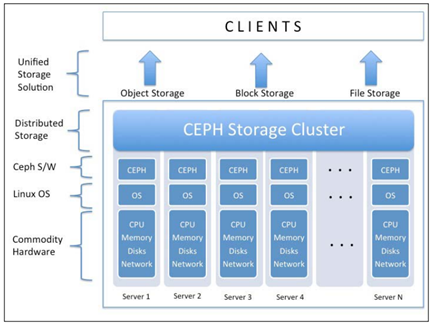

# Tổng quan về Ceph

## 1. Giới thiệu về Ceph
Ceph là 1 project mã nguồn mở, cung cấp giải pháp lưu trữ phân tán dưới dạng SDS (Software define storage). Nó cung cấp khả năng lưu trữ dữ liệu dạng block, file, object storage.

Nguyên tắc cơ bản của Ceph:
- Khả năng mở rộng tất cả thành phần
- Tính chịu lỗi cao
- Giải pháp dựa trên phần mềm, hoàn toàn mở, tính thích nghi cao
- Chạy tương thích với mọi phần cứng

## 2. Quản lý metadata
Metadata là thông tin về dữ liệu, quyết định data được ghi và đọc tại đâu. 

Với các hệ thống lưu trữ truyền thống thì sẽ cần một trung tâm quản lý, tìm kiếm thông tin về metadata. Khi mỗi client  yêu cầu hoạt động read, write thì hệ thống lưu trữ sẽ phải tìm vị trí data trong 1 bảng metadata lớn. Vì thế, với những hệ thống lưu trữ lớn thì sẽ xuất hiện độ trễ trong quá trình truy xuất dữ liệu.

Ceph không xây dựng theo phương pháp truyền thống, nó sử dụng 1 kiến trúc mới. Sử dụng lưu trữ theo thuật toán động "CRUSH algorithm". CRUSH viết tắt "Controlled Replication Under Scalable Hashing". Thay vì tìm kiếm metadata theo table trên mỗi request, thuật toán CRUSH sẽ dựa trên yêu cầu, tính toán vị trí data => cải thiện tốc độ. Hơn thế, thuật toán sẽ phân tán tới các cluster node, tận dụng sức mạnh lưu trữ phân tán. CRUSH quản lý metadata tốt hơn so với truyền thống.

CRUSH có khả năng nhận thức riêng về hạ tầng. Hiếu được mối quan hệ giữa các thành phần trong hạ tầng như system disk, pool, node, rack, power board, switch, and data center row, to the data center room and further. Khi các thành phần xảy ra lỗi, CRUSH sẽ lưu trữ bản sao data và nhân rộng chúng đến các phân vùng trong bộ nhớ, kiến data luôn sẵn sàng. Đồng thời CRUSH cho phép Ceph tự quản trị và tự sửa lỗi, CRUSH sẽ tự sửa lỗi data, nhân rộng chúng trong cluster. Tại mọi thời điểm sẽ có hơn 1 bản sao lưu data phân tán trong cluster. Vì vậy, với CRUSH ta sẽ tạo ra hạ tầng lưu trữ đảm bảo, đáng tin cậy. Sử dụng Ceph tăng tính mở rộng, đảm bảo storage system.

