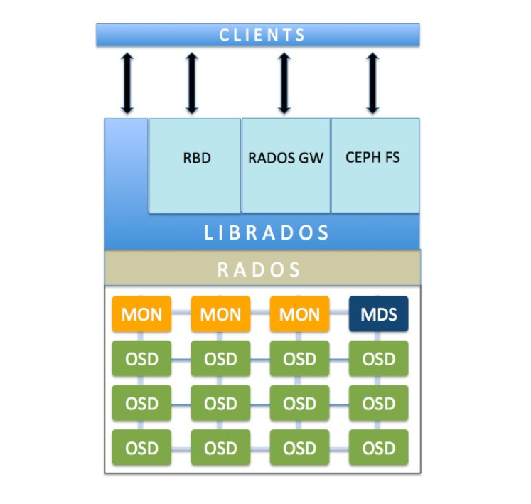

# Kiến trúc và các thành phần trong Ceph

Ceph storage cluster xây dựng từ những software daemons. Mỗi tiến trình đều có vài trò riêng trong tính năng của Ceph và có những giá trị đặc biệt tương ứng.

### 1. Ceph monitor (Ceph mon)
Ceph mon sẽ thực hiện giám sát trạng thái của cluster, giám sát trạng thái của OSD, MON, PG, CRUSH Map.

Tất cả các node trong cluster sẽ thực hiện report cho node ceph mon và chia sẻ thông tin về những trạng thái thay đổi. Ceph mon sẽ không lưu trữ dữ liệu (việc lưu trữ dữ liệu là của OSD)

### 2. Ceph object storage device (OSD)
Khi có ứng dụng có yêu cầu ghi dữ liệu vào cụm Ceph, dữ liệu sẽ được lưu trữ vào trong các OSD dưới dạng object.

Ceph OSD là thành phần duy nhất của Ceph cluster được lưu trữ dữ liệu và truy xuất khi client có yêu cầu thao tác đọc ghi. 

Ceph cluster bao gồm nhiều OSD. Thông thường, mỗi deamon OSD được gắn với 1 disk trên server. Vì thế, tổng số disk trong cluster sẽ bằng với số lượng daemon OSD hoạt động bên dưới để lưu trữ dữ liệu người dùng.

Tính năng cơ sở của Ceph bao gồm reliability (tin cậy), rebalancing, recovery, consistency (nhất quán) tới từ các OSD. Dựa trên cấu hình replication size, Ceph cung cấp bảo đảm bằng cách nhân bản mỗi object dữ liệu tới các cluster node. Mỗi Object trong OSD đều có phiên bản chính và các bản sao nằm trên các OSD khác. Vì Ceph lưu trữ phân tán nên các obj được lưu trữ trên nhiều OSD, mỗi OSD sẽ chứa 1 số phiên bản chính của Object và bản phụ 1 số object khác.

### 3. Ceph metadata server (MDS)
MDS tập trung vào phân cấp file và lưu trữ metadata dành riêng cho CephFS. Ceph block device và Rados GW không yêu cầu metadata vì chúng không cần Ceph MDS daemon.

### 4. RADOS (Reliable Autonomic Distributed Object Store)
RADOS là nền tàng của Ceph storage cluster. Mọi dữ liệu trong ceph được lưu trữ dưới dạng object. và RADOS sẽ thực hiện lưu trữ các dữ liệu này mà không quan tâm tới kiểu dữ liệu của chúng.

RADOS đảm bảo dữ liệu luôn nhất quán. Để làm điều đó, nó thực hiện replicate dữ liệu, phát hiện lỗi và khôi phục, di chuyển và rebalance dữ liệu giữa các node trong cluster

### 5. Librados
Thư viện `librados` cho phép ứng dụng làm việc với RADOS và hỗ trợ các ngôn ngữ lập trình PHP, Ruby, Java, Python, C, C++.

Nó cung cấp giao diện native cho Ceph storage cluster cũng như cho các dịch vụ khác như RBD, RGW và CephFS được xây dựng trên librados. Librados cũng hỗ trợ trực tiếp kết nối tới RADOS từ các ứng dụng không qua HTTP.

### 6. RADOS block devices (RBDs)
RBDs còn được gọi là Ceph block device, cung cấp khả năng lưu trữ dạng block, với dạng thin-provision, có thẻ thay đổi kích thước và lưu trữ dữ liệu được chia nhỏ (cắt đoạn) trên nhiều các OSD.

RBD service được xây dựng như là native interface trên thư viện librados.

### 7. RADOS gateway interface (RGW)
RGW cung cấp dịch vụ object storage. Nó sử dụng librgw (the Rados gateway Library) và librados, cho phép ứng dụng thiết lập kết nối tới Ceph object storage.

RGW cung cấp RESTful APIs với giao diện tương thích với Amazon S3 và OpenStack Swift. RGW cũng hỗ trợ OpenStack Keystone authentication services.

### 8. CephFS
CephFS cung cấp POSIX-compliant filesystem nằm trên RADOS. Nó sử dụng tiến trình MDS để quản trị metadata, tách biệt metadata khởi data, giảm phức tạp, nâng cao tính bảo đảm. CephFS thừa hưởng 1 số tính năng từ RADOS và cung cấp tính năng cân bằng động cho data.

Giống như RBD và RGW, CephFS service cũng được triển khai như một native interface cho librados.

### 9. Ceph manager
Ceph-mgr chạy cùng với các trình giám sát nền để cung cấp giao diện và giám sát bổ sung cho hệ thống quản lý.