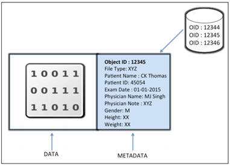
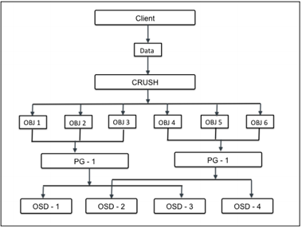

## 1. Object
Object bao gồm 2 thành phần là data và metadata.
- data: phần dữ liệu
- metadata: cung cấp thuộc tính định danh (global unique identifier) để đảm bảo object là độc nhất trong ceph cluster.



### Định vị Object - Locating objects
- Mỗi đơn vị data trong Ceph được lưu dưới dạng object trong pool.
- Ceph pool là logical partition sử dụng lưu trữ object, cung cấp pp tổ chức storage.
obj là đơn vị nhỏ nhất trong data storage tại Ceph. - Khi Ceph cluster được triển khai, nó tạo 1 số storage pool mặc định như data, metadata, and RBD pools.
- Sau khi MDS (Metadata Server) triển khai trên 1 Ceph node, nó tạo object trong metadata pool đồng thời yêu cầu CephFS để cung cấp tính năng.

## 2. CRUSH
Thuật toán CRUSH xác định cách lưu trữ và truy xuất dữ liệu bằng cách tính toán các vị trí lưu dữ liệu. Bằng cách sử dụng thuật toán CRUSH, Ceph tránh được lỗi, tắc nghẽn về hiệu suất và giới hạn vật lý với khả năng mở rộng của nó.

Nó giúp Ceph tính toán quyết định vị trí lưu trữ. Thay vì lưu trữ metadata, CRUSH tính toán metadata khi yêu cầu.

### 2.1. CRUSH MAP
CRUSH sử dụng map của cluster (CRUSH map) để map data như một cách ngẫu nhiên vào các OSD, phân tán nó trên toàn bộ cluster theo cấu hình replication.

CRUSH map chứa danh sách các OSD, phân cấp nhóm để tổng hợp các thiết bị và nhóm, và có các quy tắc để CRUSH có thể thực hiện replicate dữ liệu trong pool.

Khi triển khai thêm OSD thì chúng sẽ được tự động add vào CRUSH map mà các node đang chạy trên đó. Khi đó, kết hợp với cấu hình CRUSH failure domain sẽ đảm bảo ccs bản sao được phân phối trên các node và khi 1 node gặp sự cố thì cũng sẽ không ảnh hưởng tới dữ liệu.

### 2.2. CRUSH Location
Vị trí của OSD trong CRUSH map được gọi là CRUSH Location. Crush location có dạng danh sách cặp giá trị key value.

Ví dụ: nếu OSD nằm trong 1 row, rack, chassis, host cụ thể và một phần của `default` CRUSH root. CRUSH location có thể được mô tả như sau:
```
root=default row=a rack=a2 chassis=a2a host=a2a1
```

## 3. Placement Groups (PGs)
Khi Ceph cluster nhận yêu cầu từ data storage, nó sẽ chia thành nhiều phẩn đc gọi là placement groups (PG). Tuy nhiên, CRUSH data đầu tiên được chia nhỏ thành tập các object, dựa trên hoạt động hash trên tên object , mức nhân bản, tổng các placement groups trong hệ thông, placement groups IDs được sinh ra tương ứng.

PGs là tập logiccal các object được nhân bản trên các OSDs để nâng cao tính đảm bảo trong storage system. Dựa trên mức nhân bản của Ceph pool, mỗi PGs sẽ được nhân bản, phân tán trên nhiều hơn 1 OSD trong Ceph cluster.



