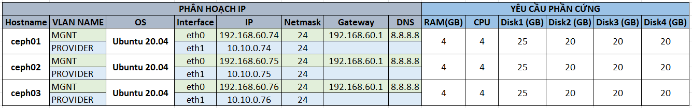
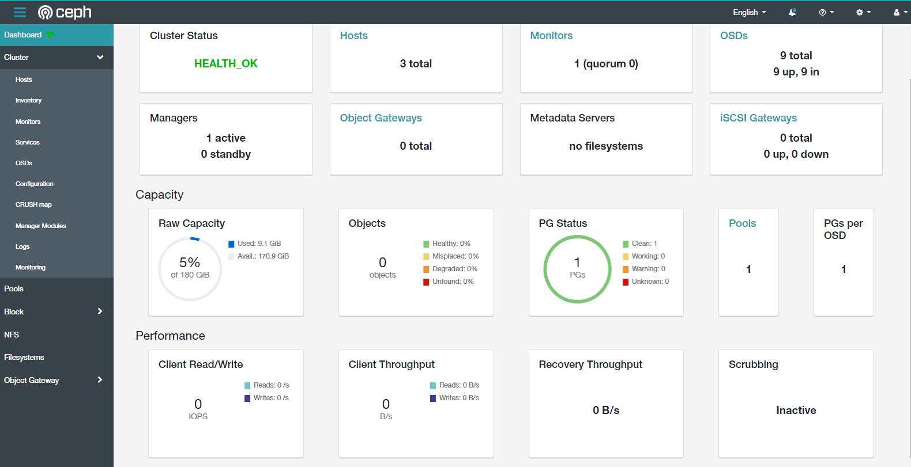

# Triển khai Ceph Cluster sử dụng Ceph-Ansible

# IP Planing


# Thiết lập môi trường
> Thực hiện trên cả 3 node

Update hệ thống:
```
apt update -y
```
Cấu hình file hosts:
```
echo "192.168.60.74 ceph01" >> /etc/hosts
echo "192.168.60.75 ceph02" >> /etc/hosts
echo "192.168.60.76 ceph03" >> /etc/hosts
```

Cấu hình ssh giữa các node:
> Đứng trên node `ceph01`

Sinh key
```
ssh-keygen
```
Copy key sang các node ceph còn lại:
```
ssh-copy-id ceph01
ssh-copy-id ceph02
ssh-copy-id ceph03
```

# Cài đặt Ceph ansible trên node ceph01
> Thực hiện trên node `ceph01`

Clone source code ceph-ansible từ github:
```
git clone https://github.com/ceph/ceph-ansible.git
```

Trong hướng dẫn này sử dụng bản Ceph octopus. Nên ta sẽ checkout sang nhánh `stable-5.0`

```
cd ceph-ansible/
git checkout stable-5.0
git pull
```

Để biết chi tiết các nhánh tương ứng với các phiên bản xem link tại [đây](https://docs.ceph.com/projects/ceph-ansible/en/latest/index.html#releases).

Cài đặt python3-pip:
```
apt install python3-pip -y
```
Đứng trong thư mục ceph-ansible thực hiện chạy lệnh dưới đây để cài đặt các thư viện python bổ sung:
```
pip install -r requirements.txt
```

### Cấu hình inventory
Tạo thư mục ansible:
```
mkdir -p /etc/ansible
```
Tạo file hosts với nội dung sau:
```
vi /etc/ansible/hosts
```
Nội dung file `/etc/ansible/hosts`
```
[mons]
ceph01

[osds]
ceph01
ceph02
ceph03

[mgrs]
ceph01

[grafana-server]
ceph01

[monitoring]
ceph01
```

Khởi tạo các file:
```
cd /root/ceph-ansible
cp site.yml.sample site.yml
cd group_vars
cp all.yml.sample all.yml
cp osds.yml.sample osds.yml
```

Cấu hình file `~/ceph-ansible/group_vars/all.yml`
```yml
cat all.yml | egrep -v '^$|^#'

---
dummy:
configure_firewall: no
ceph_origin: repository
ceph_repository: community
ceph_stable_release: octopus
monitor_interface: eth0
public_network: "192.168.60.0/24"
cluster_network: "10.10.0.0/24"
dashboard_enabled: True
dashboard_protocol: http
dashboard_port: 8080
dashboard_network: "192.168.60.0/24"
dashboard_admin_user: admin
dashboard_admin_password: Vnpt@!2022
grafana_admin_user: admin
grafana_admin_password: admin
```

Cấu hình file `~/ceph-ansible/group_vars/osd.yml`:
```yml
cat osds.yml | egrep -v '^$|^#'

---
dummy:
devices:
  - /dev/vdb
  - /dev/vdc
  - /dev/vdd
osd_auto_discovery: true
```

Chạy ansible: 
```
ansible-playbook site.yml
```

Sau khi cài đặt xong, sử dụng lệnh `ceph -s` sẽ có thông báo `mons are allowing insecure global_id reclaim`, sử dụng lệnh sau để loại bỏ check insecure:
```
ceph config set mon auth_allow_insecure_global_id_reclaim false
```

Kiểm tra trạng thái cluster trên node `ceph01`:
```
ceph -s
```
```
  cluster:
    id:     053d593d-1ced-4713-8baa-782d8aa17429
    health: HEALTH_OK

  services:
    mon: 1 daemons, quorum ceph01 (age 15h)
    mgr: ceph01(active, since 2m)
    osd: 9 osds: 9 up (since 15h), 9 in (since 39h)

  data:
    pools:   1 pools, 1 pgs
    objects: 0 objects, 0 B
    usage:   9.1 GiB used, 171 GiB / 180 GiB avail
    pgs:     1 active+clean
```

Truy cập địa chỉ IP của node ceph mon với port đã cấu hình của ceph dashboard là 8080 sẽ thấy giao diện tương tự:

`http://192.168.60.74:8080/` với tài khoản đã cấu hình trong file `all.yml` ở trên:

