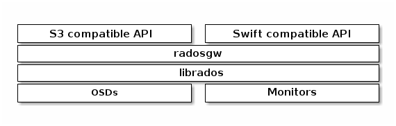

# Ceph Object Gateway

Ceph object gateway là một giao diện lưu trữ dữ liệu dạng object được xây dựng trên thư viện `librados` để cung cấp RESTful gateway cho các ứng dụng kết nối vào Ceph Storage Clusters. Ceph Object Storage hỗ trợ 2 kiểu giao tiếp:
1. **S3-compatible**: Cung cấp chức năng lưu trữ object với giao tiếp tương thích với chuẩn Amazon S3 RESTful API.
2. **Swift-comtatible**: cung cấp chuẩn tương thích với API của OpenStack Swift API.

Ceph Object Storage sử dụng tiến trình Ceph Object Gateway (`radosgw`), nó được coi như là 1 máy chủ HTTP để tương tác với Ceph Cluster.

Vì được thiết kế để tương thích với Amazon S3 và OpenStack Swift nên Ceph Object GW cung cấp khả năng quản lý người dùng riêng. 

Ceph Object GW có thể lưu trữ dữ liệu trong cùng 1 Ceph Cluster đang được sử dụng để lưu trữ dữ liệu dạng File System và Block. Các API của S3 và Swift chia sẻ namespace, vì thế người dùng có thể ghi dữ liệu bằng một API và truy xuất từ API kia.

**Lưu ý:** Ceph Object Storage không sử dụng Ceph Metadata Server

