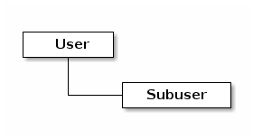

# User Management

Ceph Object Storage sử dụng user để truy cập tới dịch vụ Object Storage.

Có 2 kiểu user:
1. `User`: user là người dùng của S3 interface
2. `Subuser`: phản ánh người dùng với Swift interface. Subuser được liên kết tới 1 user.




Ta có thể thực hiện tạo, sửa, xem, suspend hoặc xóa bỏ user và subuser. Ta có thể thêm tên hiển thị hoặc email cho user.

Có thể thực hiện chỉ định key và secret key hoặc tự động sinh key cho user. 

## Các lệnh thao tác với user
### 1. Tạo user:
```
radosgw-admin user create --uid={username} --display-name="{display-name}" [--email={email}]
```

Ví dụ:
```
radosgw-admin user create --uid=cloud --display-name="Cloud VNPT" --email=cloud@vnpt.vn
```

```json
{
    "user_id": "cloud",
    "display_name": "Cloud VNPT",
    "email": "cloud@vnpt.vn",
    "suspended": 0,
    "max_buckets": 1000,
    "subusers": [],
    "keys": [
        {
            "user": "cloud",
            "access_key": "91F6X1UX4UHM1CFEM6RZ",
            "secret_key": "BR8Zc6MMMrQIiq23nqYZQCJoG1LZfkSyzwknBILr"
        }
    ],
    "swift_keys": [],
    "caps": [],
    "op_mask": "read, write, delete",
    "default_placement": "",
    "default_storage_class": "",
    "placement_tags": [],
    "bucket_quota": {
        "enabled": false,
        "check_on_raw": false,
        "max_size": -1,
        "max_size_kb": 0,
        "max_objects": -1
    },
    "user_quota": {
        "enabled": false,
        "check_on_raw": false,
        "max_size": -1,
        "max_size_kb": 0,
        "max_objects": -1
    },
    "temp_url_keys": [],
    "type": "rgw",
    "mfa_ids": []
}
```

### 2. Tạo subuser
```
radosgw-admin subuser create --uid={uid} --subuser={uid} --access=[ read | write | readwrite | full ]
```
Trong đó:
- `uid` : ID `user` mà `subuser` liên kết
- `subuser`: ID của `subuser`
- `access`: quyền truy cập của subuser
    - `full`: `full` ở đay không có nghĩa là `readwrite`, mà nó còn bao gồm các policy về kiểm soát truy cập.

Ví dụ:
```
radosgw-admin subuser create --uid=cloud --subuser=cloud:haidd --access=full
```
```json
{
    "user_id": "cloud",
    "display_name": "Cloud VNPT",
    "email": "cloud@vnpt.vn",
    "suspended": 0,
    "max_buckets": 1000,
    "subusers": [
        {
            "id": "cloud:haidd",
            "permissions": "full-control"
        }
    ],
    "keys": [
        {
            "user": "cloud",
            "access_key": "91F6X1UX4UHM1CFEM6RZ",
            "secret_key": "BR8Zc6MMMrQIiq23nqYZQCJoG1LZfkSyzwknBILr"
        }
    ],
    "swift_keys": [
        {
            "user": "cloud:haidd",
            "secret_key": "UmdgbEl166Acr4TJwTnrAcUdiOx1FGCT5UcahGn0"
        }
    ],
    "caps": [],
    "op_mask": "read, write, delete",
    "default_placement": "",
    "default_storage_class": "",
    "placement_tags": [],
    "bucket_quota": {
        "enabled": false,
        "check_on_raw": false,
        "max_size": -1,
        "max_size_kb": 0,
        "max_objects": -1
    },
    "user_quota": {
        "enabled": false,
        "check_on_raw": false,
        "max_size": -1,
        "max_size_kb": 0,
        "max_objects": -1
    },
    "temp_url_keys": [],
    "type": "rgw",
    "mfa_ids": []
}
```

### 3. List user
```
radosgw-admin user list
```

Ví dụ:
```json
# radosgw-admin user list

[
    "cloud",
    "dashboard",
    "haidd"
]
```

### 4. Xem thông tin user
```
radosgw-admin user info --uid=<user_id>
```


# Tham khảo:
- https://docs.ceph.com/en/quincy/radosgw/admin/#user-management