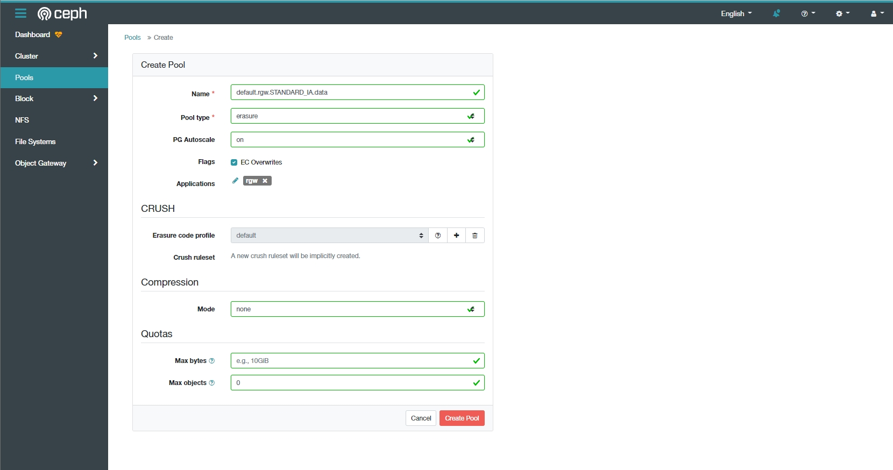

# Tier Transition with Lifecycle Policy

Một số khái niệm:
- **Zone Group**: Một tập hợp các zone được xây dựng chủ yếu trên 1 vị trí địa lý, nó có thể được coi như là Region.
- **Zone**: 1 zone chứa các dịch vụ cloud và là 1 phần của Zone Group.
- **Placement**: Sự phân tách của dữ liệu về vị trí trong 1 zone.

## Cấu hình
Theo mặc định, ta có những zonegroup, zone và placement mặc định. Ta có thể khởi tạo mới cho các thành phần này.

Trên node Ceph RGW, thực hiện lệnh:
```
radosgw-admin zonegroup get
```
```json
{
    "id": "7dc85289-391d-4c1d-a4b2-2f3f87b5ef27",
    "name": "default",
    "api_name": "default",
    "is_master": "true",
    "endpoints": [],
    "hostnames": [],
    "hostnames_s3website": [],
    "master_zone": "444ff59b-f918-4a7f-bd97-65c6a0fc7516",
    "zones": [
        {
            "id": "444ff59b-f918-4a7f-bd97-65c6a0fc7516",
            "name": "default",
            "endpoints": [],
            "log_meta": "false",
            "log_data": "false",
            "bucket_index_max_shards": 11,
            "read_only": "false",
            "tier_type": "",
            "sync_from_all": "true",
            "sync_from": [],
            "redirect_zone": ""
        }
    ],
    "placement_targets": [
        {
            "name": "default-placement",
            "tags": [],
            "storage_classes": [
                "STANDARD"
            ]
        }
    ],
    "default_placement": "default-placement",
    "realm_id": "",
    "sync_policy": {
        "groups": []
    }
}
```

Kết quả trả về ta có thể thấy là thông tin với `default-placement` id, với `storage_classes` là `STANDARD`.

Kiểm tra xem có nhưng storage class nào trong zone hiện tại, Ta sẽ thấy storage class `STANDARD` được tạo theo mặc định.

```
radosgw-admin zone get
```
```json
{
    "id": "444ff59b-f918-4a7f-bd97-65c6a0fc7516",
    "name": "default",
    "domain_root": "default.rgw.meta:root",
    "control_pool": "default.rgw.control",
    "gc_pool": "default.rgw.log:gc",
    "lc_pool": "default.rgw.log:lc",
    "log_pool": "default.rgw.log",
    "intent_log_pool": "default.rgw.log:intent",
    "usage_log_pool": "default.rgw.log:usage",
    "roles_pool": "default.rgw.meta:roles",
    "reshard_pool": "default.rgw.log:reshard",
    "user_keys_pool": "default.rgw.meta:users.keys",
    "user_email_pool": "default.rgw.meta:users.email",
    "user_swift_pool": "default.rgw.meta:users.swift",
    "user_uid_pool": "default.rgw.meta:users.uid",
    "otp_pool": "default.rgw.otp",
    "system_key": {
        "access_key": "",
        "secret_key": ""
    },
    "placement_pools": [
        {
            "key": "default-placement",
            "val": {
                "index_pool": "default.rgw.buckets.index",
                "storage_classes": {
                    "STANDARD": {
                        "data_pool": "default.rgw.buckets.data"
                    }
                },
                "data_extra_pool": "default.rgw.buckets.non-ec",
                "index_type": 0
            }
        }
    ],
    "realm_id": "",
    "notif_pool": "default.rgw.log:notif"
}
```

Ta có thể thấy thông tin về data pool của `STANDARD` storage class. Thực hiện khởi tạo một storage class mới với tên tùy ý hoặc theo tên quy chuẩn của aws. Ở đây, ta để là `STANDARD_IA`
```
radosgw-admin zonegroup placement add \
      --rgw-zonegroup default \
      --placement-id default-placement \
      --storage-class STANDARD_IA
```
Output:
```json
[
    {
        "key": "default-placement",
        "val": {
            "name": "default-placement",
            "tags": [],
            "storage_classes": [
                "STANDARD",
                "STANDARD_IA"
            ]
        }
    }
]
```
Tiếp tục, cung cấp thêm thông tin về zone placement cho storage class `STANDARD_IA` vừa khởi tạo với thuật toán nén lz4:
```
radosgw-admin zone placement add \
      --rgw-zone default \
      --placement-id default-placement \
      --storage-class STANDARD_IA \
      --data-pool default.rgw.STANDARD_IA.data \
      --compression lz4
```
Output:
```json
{
    "id": "444ff59b-f918-4a7f-bd97-65c6a0fc7516",
    "name": "default",
    "domain_root": "default.rgw.meta:root",
    "control_pool": "default.rgw.control",
    "gc_pool": "default.rgw.log:gc",
    "lc_pool": "default.rgw.log:lc",
    "log_pool": "default.rgw.log",
    "intent_log_pool": "default.rgw.log:intent",
    "usage_log_pool": "default.rgw.log:usage",
    "roles_pool": "default.rgw.meta:roles",
    "reshard_pool": "default.rgw.log:reshard",
    "user_keys_pool": "default.rgw.meta:users.keys",
    "user_email_pool": "default.rgw.meta:users.email",
    "user_swift_pool": "default.rgw.meta:users.swift",
    "user_uid_pool": "default.rgw.meta:users.uid",
    "otp_pool": "default.rgw.otp",
    "system_key": {
        "access_key": "",
        "secret_key": ""
    },
    "placement_pools": [
        {
            "key": "default-placement",
            "val": {
                "index_pool": "default.rgw.buckets.index",
                "storage_classes": {
                    "STANDARD": {
                        "data_pool": "default.rgw.buckets.data"
                    },
                    "STANDARD_IA": {
                        "data_pool": "default.rgw.STANDARD_IA.data",
                        "compression_type": "lz4"
                    }
                },
                "data_extra_pool": "default.rgw.buckets.non-ec",
                "index_type": 0
            }
        }
    ],
    "realm_id": "",
    "notif_pool": "default.rgw.log:notif"
}
```




## Cài đặt S3CMD
Cài đặt s3cmd trên node ceph01:
```
apt install s3cmd -y
```

Cấu hình cho S3cmd. thực hiện lệnh:
```
s3cmd --configure
```

Thực hiện nhập các thông tin về Access key, Secret key, S3 Endpoint,...
```
Enter new values or accept defaults in brackets with Enter.
Refer to user manual for detailed description of all options.

Access key and Secret key are your identifiers for Amazon S3. Leave them empty for using the env variables.
Access Key: 6MJ6JJ44N7SA66SPL1AK
Secret Key: ra4dJCqVON8cdDpscOrwRqrFkk0dp1XJJ14gXeHz
Default Region [US]:

Use "s3.amazonaws.com" for S3 Endpoint and not modify it to the target Amazon S3.
S3 Endpoint [s3.amazonaws.com]: 192.168.60.74

Use "%(bucket)s.s3.amazonaws.com" to the target Amazon S3. "%(bucket)s" and "%(location)s" vars can be used
if the target S3 system supports dns based buckets.
DNS-style bucket+hostname:port template for accessing a bucket [%(bucket)s.s3.amazonaws.com]: 192.168.60.74

Encryption password is used to protect your files from reading
by unauthorized persons while in transfer to S3
Encryption password:
Path to GPG program [/usr/bin/gpg]:

When using secure HTTPS protocol all communication with Amazon S3
servers is protected from 3rd party eavesdropping. This method is
slower than plain HTTP, and can only be proxied with Python 2.7 or newer
Use HTTPS protocol [Yes]: no

On some networks all internet access must go through a HTTP proxy.
Try setting it here if you can't connect to S3 directly
HTTP Proxy server name:

New settings:
  Access Key: 6MJ6JJ44N7SA66SPL1AK
  Secret Key: ra4dJCqVON8cdDpscOrwRqrFkk0dp1XJJ14gXeHz
  Default Region: US
  S3 Endpoint: 192.168.60.74
  DNS-style bucket+hostname:port template for accessing a bucket: %(bucket)s.s3.amazonaws.com
  Encryption password:
  Path to GPG program: /usr/bin/gpg
  Use HTTPS protocol: False
  HTTP Proxy server name:
  HTTP Proxy server port: 0

Test access with supplied credentials? [Y/n] Y
Please wait, attempting to list all buckets...
Success. Your access key and secret key worked fine :-)

Now verifying that encryption works...
Not configured. Never mind.

Save settings? [y/N] Y
Configuration saved to '/root/.s3cfg'
root@ceph01:~# s3cmd ls
2022-08-05 08:21  s3://bucket-cloud
```

Sau khi lưu lại settting, ta kiểm tra các bucket của user bằng lệnh:
```
s3cmd ls
```
Output:
```
2022-08-05 08:21  s3://bucket-cloud
```

## Tạo file cấu hình Lifecycle
Ví dụ: ta muốn thiết lập để di chuyển object sang 1 storage class khác là `STANDARD_IA` sau 5 ngày, và sau khi hết hạn sẽ thực hiện xóa sau 6 tháng. Ta có thể tạo 1 file cấu hình lifecycle dạng file `xml` như sau:
```xml
<LifecycleConfiguration>

  <Rule>

    <ID>Transition then Expire Rule</ID>

    <Filter>

       <Prefix></Prefix>

    </Filter>

    <Status>Enabled</Status>

    <Transition>

      <Days>5</Days>

      <StorageClass>STANDARD_IA</StorageClass>

    </Transition>

    <Expiration>

      <Days>10</Days>

    </Expiration>

  </Rule>

</LifecycleConfiguration>
```

Để thiết lập lifecycle cho bucket `bucket-cloud`, ta thực hiện lệnh như sau:
```
s3cmd setlifecycle lifecycle.xml s3://bucket-cloud
```
Output:
```
s3://bucket-cloud/: Lifecycle Policy updated
```

Xem thông tin lifecycle của bucket vừa thiết lập:
```
s3cmd info s3://bucket-cloud
```
```
s3://bucket-cloud/ (bucket):
   Location:  default
   Payer:     BucketOwner
   Expiration Rule: all objects in this bucket will expire in '10' day(s) after creation
   Policy:    none
   CORS:      none
   ACL:       Cloud VNPT: FULL_CONTROL
```

## Kết quả:
Ta sẽ kiểm tra danh sách các object ban đầu có trong bucket:
```
rados ls -p default.rgw.buckets.data

444ff59b-f918-4a7f-bd97-65c6a0fc7516.4965.1_cloud/next-cloud-1.png
444ff59b-f918-4a7f-bd97-65c6a0fc7516.4965.1_cloud/
444ff59b-f918-4a7f-bd97-65c6a0fc7516.4965.1_cloud/VNPT_ObjectStorage_Cloudian-01_MoHinhTrienKhai.drawio.png
444ff59b-f918-4a7f-bd97-65c6a0fc7516.4965.1_cloud/EKeAHNCq_400x400.png
```

Sau khi qua thời gian lifecycle 5 ngày, ta kiểm tra tại storage class `STANDARD_IA`:
```
rados ls -p default.rgw.STANDARD_IA.data

444ff59b-f918-4a7f-bd97-65c6a0fc7516.4965.1__shadow_.pnt2G46_WQAj-s8fzd4-hbA-DVWrr0e_0
444ff59b-f918-4a7f-bd97-65c6a0fc7516.4965.1__shadow_.6YrpKhMson2R5oLXixRBDi9e4jacmIX_0
444ff59b-f918-4a7f-bd97-65c6a0fc7516.4965.1__shadow_.WoPmb1TP4m8Rn8Em86wbMSfRxrb8pgC_0
```

Sau thời gian lifecycle 10 ngày, ta sẽ thấy dữ liệu sẽ bị xóa:
```
root@ceph01:~# rados ls -p default.rgw.STANDARD_IA.data | wc -l
0

root@ceph01:~# rados ls -p default.rgw.buckets.data | wc -l
0
```

> => Có thể chuyển hay khôi phục dữ liệu từ vùng `default.rgw.STANDARD_IA.data` về `default.rgw.buckets.data` không ?

# Tham khảo
- https://shonpaz.medium.com/rhcs4-0-tier-transition-self-service-data-movement-policies-fd8492a00e87
- https://knowledgebase.45drives.com/kb/kb450472-intelligent-tiering-with-lifecycle-management-on-ceph-s3/