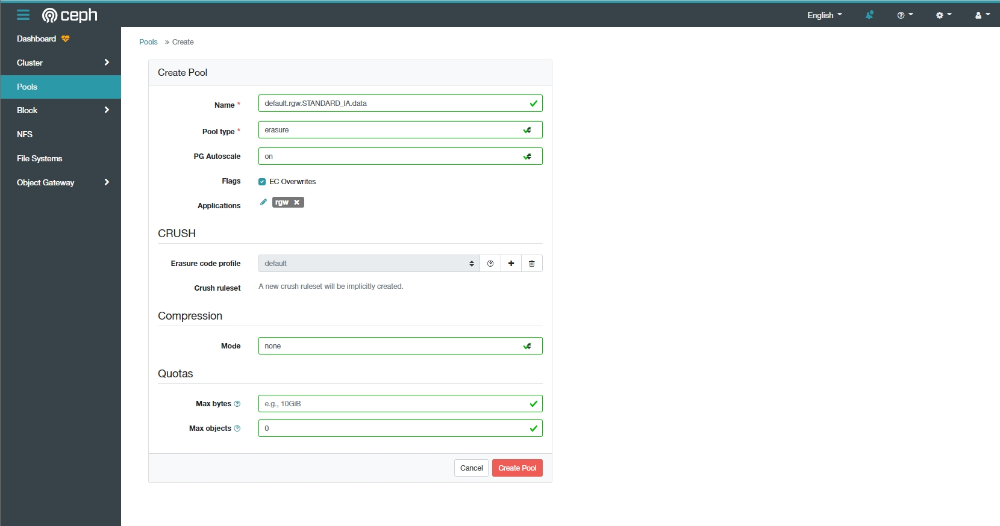

# Tiering

Một số khái niệm:
- Zone Group: Một tập hợp các zone được xây dựng chủ yếu trên 1 vị trí địa lý, nó có thể được coi như là Region.
- Zone: 1 zone chứa các dịch vụ cloud và là 1 phần của Zone Group.
- Placement: Sự phân tách của dữ liệu về vị trí trong 1 zone.

## Cấu hình
Theo mặc định, ta có những zonegroup, zone và placement mặc định. Ta có thể khởi tạo mới cho các thành phần này.

Trên node Ceph RGW, thực hiện lệnh:
```
radosgw-admin zonegroup get
```
```json
{
    "id": "7dc85289-391d-4c1d-a4b2-2f3f87b5ef27",
    "name": "default",
    "api_name": "default",
    "is_master": "true",
    "endpoints": [],
    "hostnames": [],
    "hostnames_s3website": [],
    "master_zone": "444ff59b-f918-4a7f-bd97-65c6a0fc7516",
    "zones": [
        {
            "id": "444ff59b-f918-4a7f-bd97-65c6a0fc7516",
            "name": "default",
            "endpoints": [],
            "log_meta": "false",
            "log_data": "false",
            "bucket_index_max_shards": 11,
            "read_only": "false",
            "tier_type": "",
            "sync_from_all": "true",
            "sync_from": [],
            "redirect_zone": ""
        }
    ],
    "placement_targets": [
        {
            "name": "default-placement",
            "tags": [],
            "storage_classes": [
                "STANDARD"
            ]
        }
    ],
    "default_placement": "default-placement",
    "realm_id": "",
    "sync_policy": {
        "groups": []
    }
}
```

Kết quả trả về ta có thể thấy là thông tin với `default-placement` id, với `storage_classes` là `STANDARD`.

Kiểm tra xem có nhưng storage class nào trong zone hiện tại, Ta sẽ thấy storage class `STANDARD` được tạo theo mặc định.

```
radosgw-admin zone get
```
```json
{
    "id": "444ff59b-f918-4a7f-bd97-65c6a0fc7516",
    "name": "default",
    "domain_root": "default.rgw.meta:root",
    "control_pool": "default.rgw.control",
    "gc_pool": "default.rgw.log:gc",
    "lc_pool": "default.rgw.log:lc",
    "log_pool": "default.rgw.log",
    "intent_log_pool": "default.rgw.log:intent",
    "usage_log_pool": "default.rgw.log:usage",
    "roles_pool": "default.rgw.meta:roles",
    "reshard_pool": "default.rgw.log:reshard",
    "user_keys_pool": "default.rgw.meta:users.keys",
    "user_email_pool": "default.rgw.meta:users.email",
    "user_swift_pool": "default.rgw.meta:users.swift",
    "user_uid_pool": "default.rgw.meta:users.uid",
    "otp_pool": "default.rgw.otp",
    "system_key": {
        "access_key": "",
        "secret_key": ""
    },
    "placement_pools": [
        {
            "key": "default-placement",
            "val": {
                "index_pool": "default.rgw.buckets.index",
                "storage_classes": {
                    "STANDARD": {
                        "data_pool": "default.rgw.buckets.data"
                    }
                },
                "data_extra_pool": "default.rgw.buckets.non-ec",
                "index_type": 0
            }
        }
    ],
    "realm_id": "",
    "notif_pool": "default.rgw.log:notif"
}
```

Ta có thể thấy thông tin về data pool của `STANDARD` storage class. Thực hiện khởi tạo một storage class mới với tên tùy ý hoặc theo tên quy chuẩn của aws. Ở đây, ta để là `STANDARD_IA`
```
radosgw-admin zonegroup placement add \
      --rgw-zonegroup default \
      --placement-id default-placement \
      --storage-class STANDARD_IA
```
Output:
```json
[
    {
        "key": "default-placement",
        "val": {
            "name": "default-placement",
            "tags": [],
            "storage_classes": [
                "STANDARD",
                "STANDARD_IA"
            ]
        }
    }
]
```
Tiếp tục, cung cấp thêm thông tin về zone placement cho storage class `STANDARD_IA` vừa khởi tạo với thuật toán nén lz4:
```
radosgw-admin zone placement add \
      --rgw-zone default \
      --placement-id default-placement \
      --storage-class STANDARD_IA \
      --data-pool default.rgw.STANDARD_IA.data \
      --compression lz4
```
Output:
```json
{
    "id": "444ff59b-f918-4a7f-bd97-65c6a0fc7516",
    "name": "default",
    "domain_root": "default.rgw.meta:root",
    "control_pool": "default.rgw.control",
    "gc_pool": "default.rgw.log:gc",
    "lc_pool": "default.rgw.log:lc",
    "log_pool": "default.rgw.log",
    "intent_log_pool": "default.rgw.log:intent",
    "usage_log_pool": "default.rgw.log:usage",
    "roles_pool": "default.rgw.meta:roles",
    "reshard_pool": "default.rgw.log:reshard",
    "user_keys_pool": "default.rgw.meta:users.keys",
    "user_email_pool": "default.rgw.meta:users.email",
    "user_swift_pool": "default.rgw.meta:users.swift",
    "user_uid_pool": "default.rgw.meta:users.uid",
    "otp_pool": "default.rgw.otp",
    "system_key": {
        "access_key": "",
        "secret_key": ""
    },
    "placement_pools": [
        {
            "key": "default-placement",
            "val": {
                "index_pool": "default.rgw.buckets.index",
                "storage_classes": {
                    "STANDARD": {
                        "data_pool": "default.rgw.buckets.data"
                    },
                    "STANDARD_IA": {
                        "data_pool": "default.rgw.STANDARD_IA.data",
                        "compression_type": "lz4"
                    }
                },
                "data_extra_pool": "default.rgw.buckets.non-ec",
                "index_type": 0
            }
        }
    ],
    "realm_id": "",
    "notif_pool": "default.rgw.log:notif"
}
```


