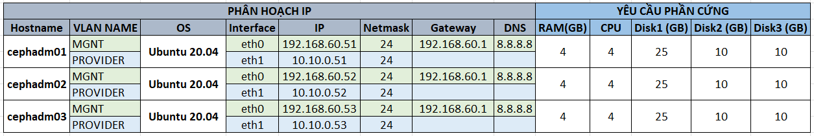

# Deploy Ceph Cluster Quincy sử dụng `cephadm` trên Ubuntu

# IP Planing


# 1. Thiết lập ban đầu
> ### Thực hiện trên tất cả các node
### 1.1. Update hệ thống
Update:
```
apt update -y
```

Reboot:
```
init 6
```

### 1.2. Cấu hình file hosts
Thêm cấu hình file hosts `/etc/hosts` vào tất cả các node:
```
192.168.60.51   cephadm01
192.168.60.52   cephadm02
192.168.60.53   cephadm03
```

### 1.3. Cài đặt Docker
Thực hiện cài đặt Docker
```
apt-get install -y\
    ca-certificates \
    curl \
    gnupg \
    lsb-release

sudo mkdir -p /etc/apt/keyrings

curl -fsSL https://download.docker.com/linux/ubuntu/gpg | sudo gpg --dearmor -o /etc/apt/keyrings/docker.gpg

echo \
  "deb [arch=$(dpkg --print-architecture) signed-by=/etc/apt/keyrings/docker.gpg] https://download.docker.com/linux/ubuntu \
  $(lsb_release -cs) stable" | sudo tee /etc/apt/sources.list.d/docker.list > /dev/null

apt-get update -y

apt-get install -y docker-ce docker-ce-cli containerd.io docker-compose-plugin
```

Kiểm tra version:
```
root@cephamd01:~# docker --version
Docker version 20.10.17, build 100c701
```

### 1.4. Disble firewall
```
ufw disable
```

# 2. Cài đặt Cephadm và Deploy Ceph Cluster
### 2.1. Cài đặt `cephadm`
> ### Thực hiện trên node `cephadm01`
`Lưu ý:` Có thể thực hiện cài đặt cephadm trên 1 node riêng biệt
Cài đặt cephadm:
```
curl --silent --remote-name --location https://github.com/ceph/ceph/raw/quincy/src/cephadm/cephadm

chmod +x cephadm

./cephadm add-repo --release quincy

./cephadm install
```

Kiểm tra path của cephadm:
```
which cephadm
```
Output:
```
/usr/sbin/cephadm
```

Kiểm tra version cephadm:
```
cephadm version
```

Cài đặt thêm ceph-common
```
apt install ceph-common -y
```

### 2.2. Bootstrap Ceph Cluster
> ### Thực hiện trên node `cephadm01`
Tạo thư mục cấu hình của ceph:
```
mkdir -p /etc/ceph
```

Khởi tạo 1 cluster với IP của node Ceph mon. Ở đây, ta sẽ lấy node `cephadm01` để làm node Ceph mon:
```
cephadm bootstrap --mon-ip 192.168.60.51  --cluster-network 10.10.0.0/24
```
Trong đó:
- `--mon-ip`: IP node ceph mon đầu tiên
- `--cluster-network`: dải mạng dùng để replicate, recovery,... các node trong cluster.

Sau khi thực hiện lệnh này thì hệ thống sẽ thực hiện các bước sau:
- Khởi tạo daemon monitor và manager cho cluster mới trên node `cephadm01`
- Tạo SSH key và thêm vào file `/root/.ssh/authorized_keys`
- Sinh

Xem thêm các tham số khi khởi tạo tại [đây](https://docs.ceph.com/en/quincy/cephadm/install/#further-information-about-cephadm-bootstrap).

```
Verifying podman|docker is present...
Verifying lvm2 is present...
Verifying time synchronization is in place...
Unit systemd-timesyncd.service is enabled and running
Repeating the final host check...
docker (/usr/bin/docker) is present
systemctl is present
lvcreate is present
Unit systemd-timesyncd.service is enabled and running
Host looks OK
Cluster fsid: 765a38d6-f6c7-11ec-8d73-e143fe0df38b
Verifying IP 192.168.60.51 port 3300 ...
Verifying IP 192.168.60.51 port 6789 ...
Mon IP `192.168.60.51` is in CIDR network `192.168.60.0/24`
Mon IP `192.168.60.51` is in CIDR network `192.168.60.0/24`
Pulling container image quay.io/ceph/ceph:v17...
Ceph version: ceph version 17.2.1 (ec95624474b1871a821a912b8c3af68f8f8e7aa1) quincy (stable)
Extracting ceph user uid/gid from container image...
Creating initial keys...
Creating initial monmap...
Creating mon...
Waiting for mon to start...
Waiting for mon...
mon is available
Assimilating anything we can from ceph.conf...
Generating new minimal ceph.conf...
Restarting the monitor...
Setting mon public_network to 192.168.60.0/24
Setting cluster_network to 10.10.0.0/24
Wrote config to /etc/ceph/ceph.conf
Wrote keyring to /etc/ceph/ceph.client.admin.keyring
Creating mgr...
Verifying port 9283 ...
Waiting for mgr to start...
Waiting for mgr...
mgr not available, waiting (1/15)...
mgr not available, waiting (2/15)...
mgr is available
Enabling cephadm module...
Waiting for the mgr to restart...
Waiting for mgr epoch 5...
mgr epoch 5 is available
Setting orchestrator backend to cephadm...
Generating ssh key...
Wrote public SSH key to /etc/ceph/ceph.pub
Adding key to root@localhost authorized_keys...
Adding host cephadm01...
Deploying mon service with default placement...
Deploying mgr service with default placement...
Deploying crash service with default placement...
Deploying prometheus service with default placement...
Deploying grafana service with default placement...
Deploying node-exporter service with default placement...
Deploying alertmanager service with default placement...
Enabling the dashboard module...
Waiting for the mgr to restart...
Waiting for mgr epoch 9...
mgr epoch 9 is available
Generating a dashboard self-signed certificate...
Creating initial admin user...
Fetching dashboard port number...
Ceph Dashboard is now available at:

             URL: https://cephadm01:8443/
            User: admin
        Password: v76p4mzrk1

Enabling client.admin keyring and conf on hosts with "admin" label
Saving cluster configuration to /var/lib/ceph/765a38d6-f6c7-11ec-8d73-e143fe0df38b/config directory
Enabling autotune for osd_memory_target
You can access the Ceph CLI as following in case of multi-cluster or non-default config:

        sudo /usr/sbin/cephadm shell --fsid 765a38d6-f6c7-11ec-8d73-e143fe0df38b -c /etc/ceph/ceph.conf -k /etc/ceph/ceph.client.admin.keyring

Or, if you are only running a single cluster on this host:

        sudo /usr/sbin/cephadm shell

Please consider enabling telemetry to help improve Ceph:

        ceph telemetry on

For more information see:

        https://docs.ceph.com/docs/master/mgr/telemetry/

Bootstrap complete.
```

Kiểm tra phiên bản ceph:
```
root@cephadm01:~# ceph -v
ceph version 17.2.1 (ec95624474b1871a821a912b8c3af68f8f8e7aa1) quincy (stable)
```

# 3. Thêm host vào cluster
Tạo key ssh và copy sang các node còn lại:
```
ssh-keygen
ssh-copy-id cephadm01
ssh-copy-id cephadm02
ssh-copy-id cephadm03
```

Thiết lập key ssh:
```
ssh-copy-id -f -i /etc/ceph/ceph.pub root@cephadm02
ssh-copy-id -f -i /etc/ceph/ceph.pub root@cephadm03
```

### 3.1. Thiết lập alias cho ceph CLI
Để có thể dùng lệnh `ceph` trên node cephadm thì ta có thể khởi tạo alias cho lệnh `cephadm shell`
```
alias ceph='cephadm shell -- ceph'
echo "alias ceph='cephadm shell -- ceph'" >> ~/.bashrc
```

**Lưu ý**: Khi cần kiểm tra nhiều thông tin thì nên truy cập vào cephadm shell để thao tác cho nhanh.

### 3.2. Thêm 2 node còn lại vào cluster
> Đứng trên node cephadm01

Sử dụng cephadm shell:
```
cephadm shell
```

Thêm 2 node `cephadm02` và `cephadm03` vào cluster:
```
ceph orch host add cephadm02 192.168.60.52
ceph orch host add cephadm03 192.168.60.53
```

Kiểm tra các host đang có trong cluster:
```
ceph orch host ls

HOST       ADDR           LABELS  STATUS
cephadm01  192.168.60.51  _admin
cephadm02  192.168.60.52
cephadm03  192.168.60.53
3 hosts in cluster
```

Kiểm tra daemon trên các node:
```
ceph orch ps cephadm02

NAME                     HOST       PORTS        STATUS         REFRESHED  AGE  MEM USE  MEM LIM  VERSION  IMAGE ID      CONTAINER ID
crash.cephadm02          cephadm02               running (15h)    16s ago  15h    7304k        -  17.2.1   e5af760fa1c1  f262b1ff724a
mgr.cephadm02.bkhqol     cephadm02  *:8443,9283  running (15h)    16s ago  15h     419M        -  17.2.1   e5af760fa1c1  55c26d16ba59
mon.cephadm02            cephadm02               running (15h)    16s ago  15h     232M    2048M  17.2.1   e5af760fa1c1  6a68fcd0ba1a
node-exporter.cephadm02  cephadm02  *:9100       running (15h)    16s ago  15h    12.9M        -           1dbe0e931976  4c32f4301c5d
```

# 4. Thêm và cấu hình OSD
Kiểm tra các device chưa sử dụng trên các node trong cluster:
```
ceph orch device ls
```
Output:
```
HOST       PATH      TYPE  DEVICE ID              SIZE  AVAILABLE  REFRESHED  REJECT REASONS
cephadm01  /dev/vdb  hdd   c60052f8-b5d5-419b-8  10.7G  Yes        27m ago
cephadm01  /dev/vdc  hdd   b69bd2c0-10f5-4f87-a  10.7G  Yes        27m ago
cephadm02  /dev/vdb  hdd   84679466-e716-4e71-8  10.7G  Yes        28m ago
cephadm02  /dev/vdc  hdd   dc9513cc-79c1-47d6-b  10.7G  Yes        28m ago
cephadm03  /dev/vdb  hdd   7d076306-6470-4c73-a  10.7G  Yes        23m ago
cephadm03  /dev/vdc  hdd   46f7f8ec-af56-462b-b  10.7G  Yes        23m ago
```

**Lưu ý:** Những osd available phải đáp ứng các tiêu chí sau:
- Chưa được phân vùng
- Chưa có bất kỳ trạng thái LVM nào
- Không được gắn (mount) vào bất kỳ đâu
- Không chứa file system
- Không chứa Ceph BlueStore OSD
- Có kích thước >5GB

Để thêm tất cả các OSD từ các deivce khả dụng. Sử dụng lệnh:
```
ceph orch apply osd --all-available-devices
```

Ngoài ra, ta có thể thực hiện tạo OSD theo ổ trên từng node bằng lệnh:
```
ceph orch daemon add osd <host>:<device-path>
```
Ví dụ:
```
ceph orch daemon add osd cephadm01:/dev/sdb
```

Có thể gặp tình trạng một số các osd không thể up. Khi đó, ta thực hiện restart docker container của osd đó.sau khi restart ta sẽ có trạng thái như dưới đây:
```
root@cephadm01:/# ceph osd  df
ID  CLASS  WEIGHT   REWEIGHT  SIZE    RAW USE  DATA     OMAP  META     AVAIL   %USE  VAR   PGS  STATUS
 1    hdd  0.00980   1.00000  10 GiB   23 MiB  976 KiB   0 B   22 MiB  10 GiB  0.22  1.91    1      up
 4    hdd  0.00980   1.00000  10 GiB   20 MiB  396 KiB   0 B   20 MiB  10 GiB  0.20  1.69    0      up
 2    hdd  0.00980   1.00000  10 GiB  6.3 MiB  396 KiB   0 B  5.9 MiB  10 GiB  0.06  0.53    0      up
 5    hdd  0.00980   1.00000  10 GiB  7.0 MiB  976 KiB   0 B  6.1 MiB  10 GiB  0.07  0.59    0      up
 0    hdd  0.00980   1.00000  10 GiB  6.1 MiB  396 KiB   0 B  5.8 MiB  10 GiB  0.06  0.52    0      up
 3    hdd  0.00980   1.00000  10 GiB  9.0 MiB  976 KiB   0 B  7.8 MiB  10 GiB  0.09  0.75    1      up
                       TOTAL  60 GiB   71 MiB  4.0 MiB   0 B   67 MiB  60 GiB  0.12
MIN/MAX VAR: 0.52/1.91  STDDEV: 0.07
```

# 5. Dashboard
Truy cập dashboard: với thông tin đăng nhập sau khi chạy lệnh bootstrap ở trên:

```
Ceph Dashboard is now available at:

             URL: https://cephadm01:8443/
            User: admin
        Password: v76p4mzrk1
```

