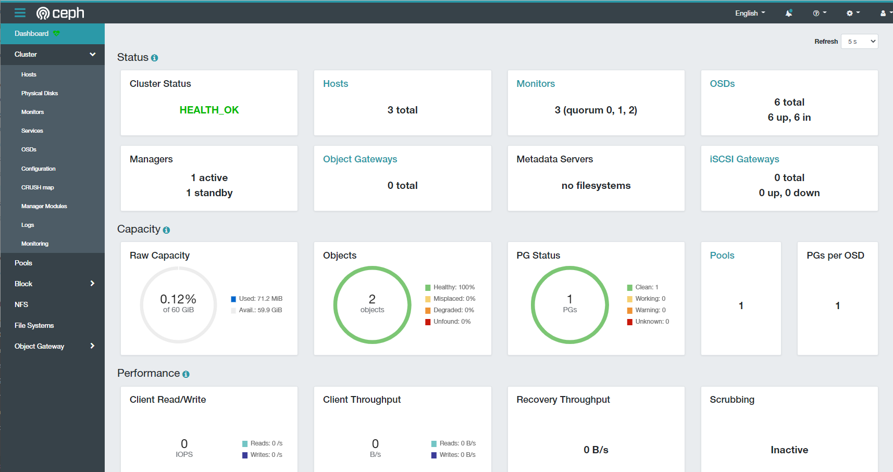

# Deploy Ceph Cluster Quincy sử dụng `cephadm` trên Ubuntu

# IP Planing


# 1. Thiết lập ban đầu
> ### Thực hiện trên tất cả các node
### 1.1. Update hệ thống
Update:
```
apt update -y
```

Reboot:
```
init 6
```

### 1.2. Cấu hình file hosts
Thêm cấu hình file hosts `/etc/hosts` vào tất cả các node:
```
192.168.60.71   cephadm01
192.168.60.72   cephadm02
192.168.60.73   cephadm03
```

### 1.3. Cài đặt Docker
Thực hiện cài đặt Docker
```
apt-get install -y\
    ca-certificates \
    curl \
    gnupg \
    lsb-release

sudo mkdir -p /etc/apt/keyrings

curl -fsSL https://download.docker.com/linux/ubuntu/gpg | sudo gpg --dearmor -o /etc/apt/keyrings/docker.gpg

echo \
  "deb [arch=$(dpkg --print-architecture) signed-by=/etc/apt/keyrings/docker.gpg] https://download.docker.com/linux/ubuntu \
  $(lsb_release -cs) stable" | sudo tee /etc/apt/sources.list.d/docker.list > /dev/null

apt-get update -y

apt-get install -y docker-ce docker-ce-cli containerd.io docker-compose-plugin
```

Kiểm tra version:
```
root@cephamd01:~# docker --version
Docker version 20.10.17, build 100c701
```

### 1.4. Disble firewall
```
ufw disable
```

# 2. Cài đặt Cephadm và Deploy Ceph Cluster
### 2.1. Cài đặt `cephadm`
> ### Thực hiện trên node `cephadm01`
`Lưu ý:` Có thể thực hiện cài đặt cephadm trên 1 node riêng biệt
Cài đặt cephadm:
```
curl --silent --remote-name --location https://github.com/ceph/ceph/raw/pacific/src/cephadm/cephadm

chmod +x cephadm

./cephadm add-repo --release pacific

./cephadm install
```

Kiểm tra path của cephadm:
```
which cephadm
```
Output:
```
/usr/sbin/cephadm
```

Kiểm tra version cephadm:
```
cephadm version

ceph version 16.2.10 (45fa1a083152e41a408d15505f594ec5f1b4fe17) pacific (stable)
```

Cài đặt thêm ceph-common
```
apt install ceph-common -y
```

### 2.2. Bootstrap Ceph Cluster
> ### Thực hiện trên node `cephadm01`
Tạo thư mục cấu hình của ceph:
```
mkdir -p /etc/ceph
```

Khởi tạo 1 cluster với IP của node Ceph mon. Ở đây, ta sẽ lấy node `cephadm01` để làm node Ceph mon:
```
cephadm bootstrap \
--mon-ip 192.168.60.71 \
--cluster-network 10.10.0.0/24 \
--initial-dashboard-user admin --initial-dashboard-password "Vnpt2022" \
--dashboard-password-noupdate
```
Nếu muốn cấu hình sẵn file ceph.conf thì truyền thêm option:
```
--config <ceph_config_file>
```


Trong đó:
- `--mon-ip`: IP node ceph mon đầu tiên
- `--cluster-network`: dải mạng dùng để replicate, recovery,... các node trong cluster.

Sau khi thực hiện lệnh này thì hệ thống sẽ thực hiện các bước sau:
- Khởi tạo daemon monitor và manager cho cluster mới trên node `cephadm01`
- Tạo SSH key và thêm vào file `/root/.ssh/authorized_keys`
- Sinh

Xem thêm các tham số khi khởi tạo tại [đây](https://docs.ceph.com/en/pacific/cephadm/install/#further-information-about-cephadm-bootstrap).

```
Verifying podman|docker is present...
Verifying lvm2 is present...
Verifying time synchronization is in place...
Unit systemd-timesyncd.service is enabled and running
Repeating the final host check...
docker (/usr/bin/docker) is present
systemctl is present
lvcreate is present
Unit systemd-timesyncd.service is enabled and running
Host looks OK
Cluster fsid: 9e58d7bc-238a-11ed-8697-47bf0a6dae70
Verifying IP 192.168.60.71 port 3300 ...
Verifying IP 192.168.60.71 port 6789 ...
Mon IP `192.168.60.71` is in CIDR network `192.168.60.0/24`
Pulling container image quay.io/ceph/ceph:v16...
Ceph version: ceph version 16.2.10 (45fa1a083152e41a408d15505f594ec5f1b4fe17) pacific (stable)
Extracting ceph user uid/gid from container image...
Creating initial keys...
Creating initial monmap...
Creating mon...
Waiting for mon to start...
Waiting for mon...
mon is available
Assimilating anything we can from ceph.conf...
Generating new minimal ceph.conf...
Restarting the monitor...
Setting mon public_network to 192.168.60.0/24
Setting cluster_network to 10.10.0.0/24
Wrote config to /etc/ceph/ceph.conf
Wrote keyring to /etc/ceph/ceph.client.admin.keyring
Creating mgr...
Verifying port 9283 ...
Waiting for mgr to start...
Waiting for mgr...
mgr not available, waiting (1/15)...
mgr not available, waiting (2/15)...
mgr not available, waiting (3/15)...
mgr not available, waiting (4/15)...
mgr not available, waiting (5/15)...
mgr is available
Enabling cephadm module...
Waiting for the mgr to restart...
Waiting for mgr epoch 5...
mgr epoch 5 is available
Setting orchestrator backend to cephadm...
Generating ssh key...
Wrote public SSH key to /etc/ceph/ceph.pub
Adding key to root@localhost authorized_keys...
Adding host cephadm-01...
Deploying mon service with default placement...
Deploying mgr service with default placement...
Deploying crash service with default placement...
Deploying prometheus service with default placement...
Deploying grafana service with default placement...
Deploying node-exporter service with default placement...
Deploying alertmanager service with default placement...
Enabling the dashboard module...
Waiting for the mgr to restart...
Waiting for mgr epoch 9...
mgr epoch 9 is available
Generating a dashboard self-signed certificate...
Creating initial admin user...
Fetching dashboard port number...
Ceph Dashboard is now available at:

             URL: https://cephadm-01:8443/
            User: admin
        Password: Vnpt2022

Enabling client.admin keyring and conf on hosts with "admin" label
Enabling autotune for osd_memory_target
You can access the Ceph CLI as following in case of multi-cluster or non-default config:

        sudo /usr/sbin/cephadm shell --fsid 9e58d7bc-238a-11ed-8697-47bf0a6dae70 -c /etc/ceph/ceph.conf -k /etc/ceph/ceph.client.admin.keyring

Or, if you are only running a single cluster on this host:

        sudo /usr/sbin/cephadm shell

Please consider enabling telemetry to help improve Ceph:

        ceph telemetry on

For more information see:

        https://docs.ceph.com/en/pacific/mgr/telemetry/

Bootstrap complete.
```

Kiểm tra phiên bản ceph:
```
root@cephadm01:~# ceph -v
ceph version 16.2.10 (45fa1a083152e41a408d15505f594ec5f1b4fe17) pacific (stable)
```

# 3. Thêm host vào cluster
### 3.1. Copy key sang các node còn lại
Tạo key ssh và copy sang các node còn lại:
```
ssh-keygen
ssh-copy-id cephadm-01
ssh-copy-id cephadm-02
ssh-copy-id cephadm-03
```

Thiết lập key ssh:
```
ssh-copy-id -f -i /etc/ceph/ceph.pub root@cephadm-02
ssh-copy-id -f -i /etc/ceph/ceph.pub root@cephadm-03
```

### 3.2. Thêm 2 node còn lại vào cluster
> Đứng trên node cephadm01

Tạo file `host.yaml` với các thông tin của các host theo định dạng sau:
```yaml
service_type: host
hostname: cephadm-01
addr: 192.168.60.71
---
service_type: host
hostname: cephadm-02
addr: 192.168.60.72
---
service_type: host
hostname: cephadm-03
addr: 192.168.60.73
```

Thực hiện chạy lệnh sau để thêm và cấu hình các host đã khai báo ở trên:
```
ceph orch apply -i host.yaml
```

Kiểm tra các host đang có trong cluster:
```
root@cephadm-01:~# ceph orch host ls
HOST        ADDR           LABELS  STATUS
cephadm-01  192.168.60.71  _admin
cephadm-02  192.168.60.72
cephadm-03  192.168.60.73
3 hosts in cluster
```

Kiểm tra daemon trên các node:
```
root@cephadm-01:~# ceph orch ps cephadm-02
NAME                      HOST        PORTS        STATUS        REFRESHED  AGE  MEM USE  MEM LIM  VERSION  IMAGE ID      CONTAINER ID
crash.cephadm-02          cephadm-02               running (5m)     2m ago   5m    8664k        -  16.2.10  0d668911f040  fdec7c88b1af
mgr.cephadm-02.vvrcjf     cephadm-02  *:8443,9283  running (5m)     2m ago   5m     372M        -  16.2.10  0d668911f040  38890adfd593
mon.cephadm-02            cephadm-02               running (5m)     2m ago   5m    83.3M    2048M  16.2.10  0d668911f040  97e4ce73603d
node-exporter.cephadm-02  cephadm-02  *:9100       running (5m)     2m ago   5m    3999k        -           1dbe0e931976  846d62b6bebc
```

# 4. Thêm và cấu hình OSD
Kiểm tra các device chưa sử dụng trên các node trong cluster:
```
ceph orch device ls
```
Output:
```
HOST       PATH      TYPE  DEVICE ID              SIZE  AVAILABLE  REFRESHED  REJECT REASONS
cephadm01  /dev/vdb  hdd   c60052f8-b5d5-419b-8  10.7G  Yes        27m ago
cephadm01  /dev/vdc  hdd   b69bd2c0-10f5-4f87-a  10.7G  Yes        27m ago
cephadm02  /dev/vdb  hdd   84679466-e716-4e71-8  10.7G  Yes        28m ago
cephadm02  /dev/vdc  hdd   dc9513cc-79c1-47d6-b  10.7G  Yes        28m ago
cephadm03  /dev/vdb  hdd   7d076306-6470-4c73-a  10.7G  Yes        23m ago
cephadm03  /dev/vdc  hdd   46f7f8ec-af56-462b-b  10.7G  Yes        23m ago
```

**Lưu ý:** Những osd available phải đáp ứng các tiêu chí sau:
- Chưa được phân vùng
- Chưa có bất kỳ trạng thái LVM nào
- Không được gắn (mount) vào bất kỳ đâu
- Không chứa file system
- Không chứa Ceph BlueStore OSD
- Có kích thước >5GB

## 4.1. Thêm ổ đĩa 
Để thêm tất cả các OSD từ các deivce khả dụng. Sử dụng lệnh:
```
ceph orch apply osd --all-available-devices
```

Ngoài ra, ta có thể thực hiện tạo OSD theo ổ trên từng node bằng lệnh:
```
ceph orch daemon add osd <host>:<device-path>
```
Ví dụ:
```
ceph orch daemon add osd cephadm-01:/dev/sdb
```

Có thể gặp tình trạng một số các osd không thể up. Khi đó, ta thực hiện restart docker container của osd đó.sau khi restart ta sẽ có trạng thái như dưới đây:
```
root@cephadm-01:~# ceph osd df

ID  CLASS  WEIGHT   REWEIGHT  SIZE     RAW USE  DATA     OMAP  META     AVAIL    %USE  VAR   PGS  STATUS
 2    hdd  0.01949   1.00000   20 GiB  5.1 MiB  212 KiB   0 B  4.9 MiB   20 GiB  0.02  1.00    0      up
 5    hdd  0.01949   1.00000   20 GiB  5.1 MiB  212 KiB   0 B  4.9 MiB   20 GiB  0.02  1.00    1      up
 8    hdd  0.01949   1.00000   20 GiB  5.0 MiB  212 KiB   0 B  4.8 MiB   20 GiB  0.02  0.99    0      up
 0    hdd  0.01949   1.00000   20 GiB  5.1 MiB  212 KiB   0 B  4.9 MiB   20 GiB  0.02  1.00    0      up
 4    hdd  0.01949   1.00000   20 GiB  5.1 MiB  212 KiB   0 B  4.9 MiB   20 GiB  0.02  1.00    0      up
 7    hdd  0.01949   1.00000   20 GiB  5.1 MiB  212 KiB   0 B  4.9 MiB   20 GiB  0.02  1.00    1      up
 1    hdd  0.01949   1.00000   20 GiB  5.1 MiB  212 KiB   0 B  4.9 MiB   20 GiB  0.02  1.00    0      up
 3    hdd  0.01949   1.00000   20 GiB  5.1 MiB  212 KiB   0 B  4.9 MiB   20 GiB  0.02  1.00    1      up
 6    hdd  0.01949   1.00000   20 GiB  5.1 MiB  212 KiB   0 B  4.9 MiB   20 GiB  0.02  1.00    0      up
                       TOTAL  180 GiB   46 MiB  1.9 MiB   0 B   44 MiB  180 GiB  0.02
MIN/MAX VAR: 0.99/1.00  STDDEV: 0
```

## 4.2. Sử dụng file yaml để triển khai
Tạo 1 file `osd.yaml`
```yaml
service_type: osd
service_id: osd_using_paths
placement:
  hosts:
    - cephadm-01
    - cephadm-02
    - cephadm-03
spec:
  data_devices:
    paths:
    - /dev/vdb
    - /dev/vdc
    - /dev/vdd
  db_devices:
    paths:
  wal_devices:
    paths:
```
Chạy lệnh:
```
ceph orch apply -i osd.yaml
```

# 5. Dashboard
Truy cập dashboard: với thông tin đăng nhập đã truyền khi chạy lệnh bootstrap. Ở đây là `Vnpt2022`

```
Ceph Dashboard is now available at:

             URL: https://cephadm01:8443/
            User: admin
        Password: v76p4mzrk1
```

